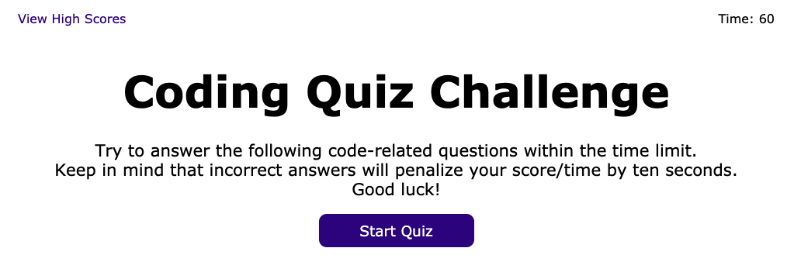
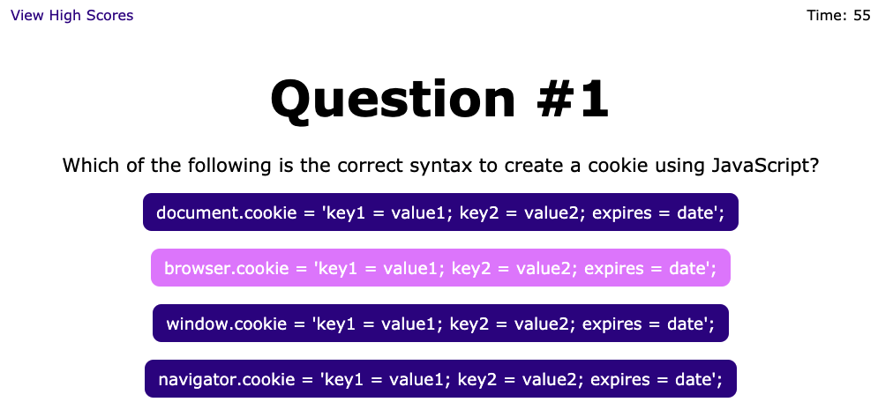
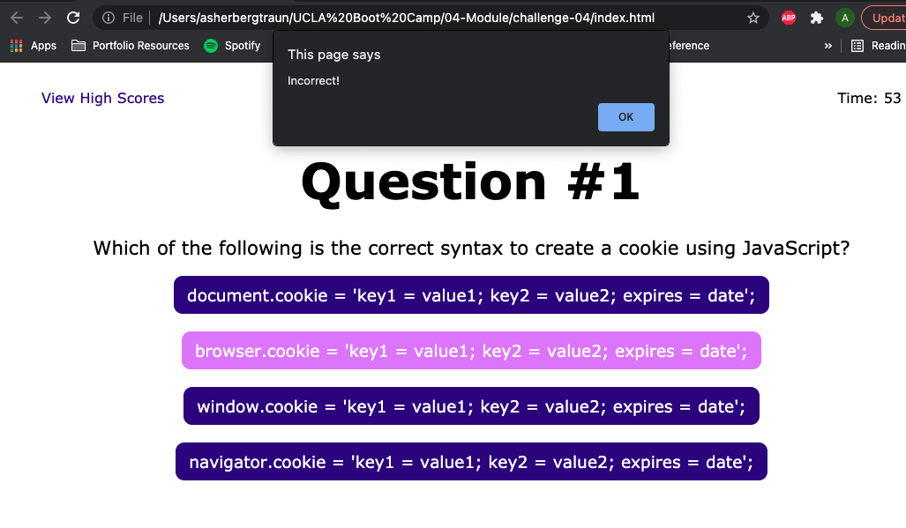
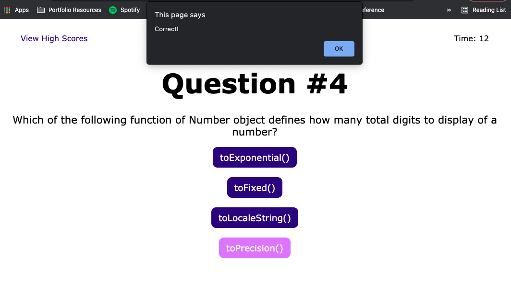
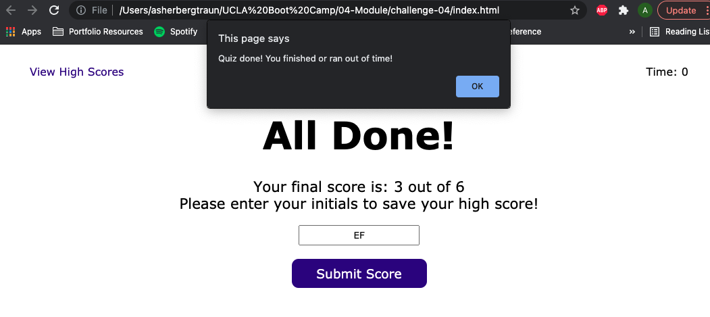
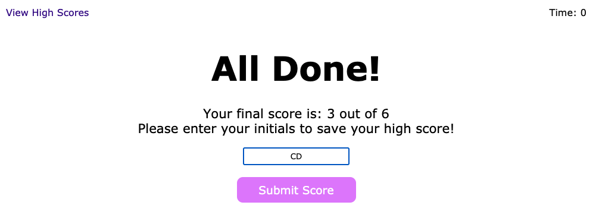
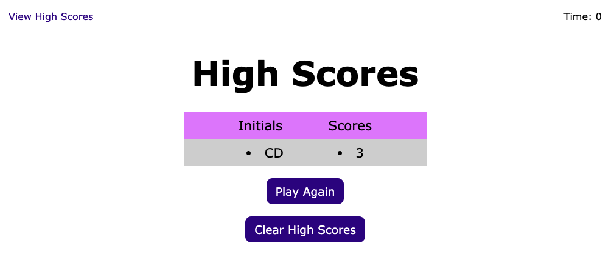
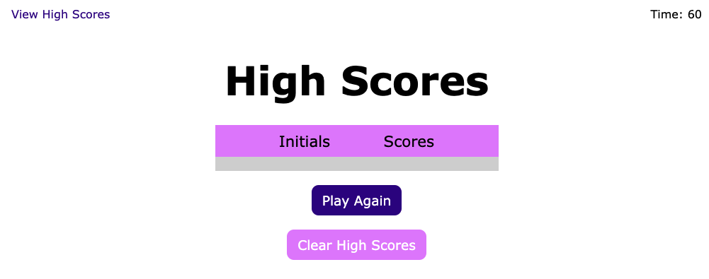

# Project Title
Challenge 4 

# Description
This interactive application is a timed coding quiz with multiple questions. 
This application runs in your browser with a dynamically updated HTML and CSS powered by JavaScript code.
It uses local storage to post and save high scores so you can compete with friends!

Follow this [link](https://github.com/abergtra/challenge-04) for the GitHub repository.
Follow this [link](https://abergtra.github.io/challenge-04/) for the live URL.

# Table of Contents 
* [Installation](#-Installation)
* [Usage](#-Usage)
* [License](#-Installation)
* [Contributing](#-Contributing)
* [Tests](#-Tests)
* [Questions](#-Questions)
    
# Installation
No installation steps are necessary, just run the application in your favorite browser (Chrome-nation all the way)!

# Usage
This application is optimized to simplify usage. Click the start button to start the quiz and the timer:

Click the answer you think is correct:

You will be alerted if your answer is incorrect and you will lose time:

Congratulations! You got an answer right and lose no time:

If you run out of time or answer all the questions you will be alerted and sent to the end page:

Input your initials and submit your high score:

Now you can see and compare high scores:

If you got beaten, clear the high scores and play again:

Walkthrough:

A video walkthrough is also available if you follow this [link](https://youtu.be/t3P8qioTuJQ).

# License 
[License: MIT](https://opensource.org/licenses/MIT) 
* As this list provided is not comprehensive, if you need another license, contact the author for additional options. 

# Contributing 
Please contact the author about contributing.

# Tests
There are no tests available for this application.

# Questions
* GitHub Username: abergtra
* Contact Email: asher.bergtraun@gmail.com